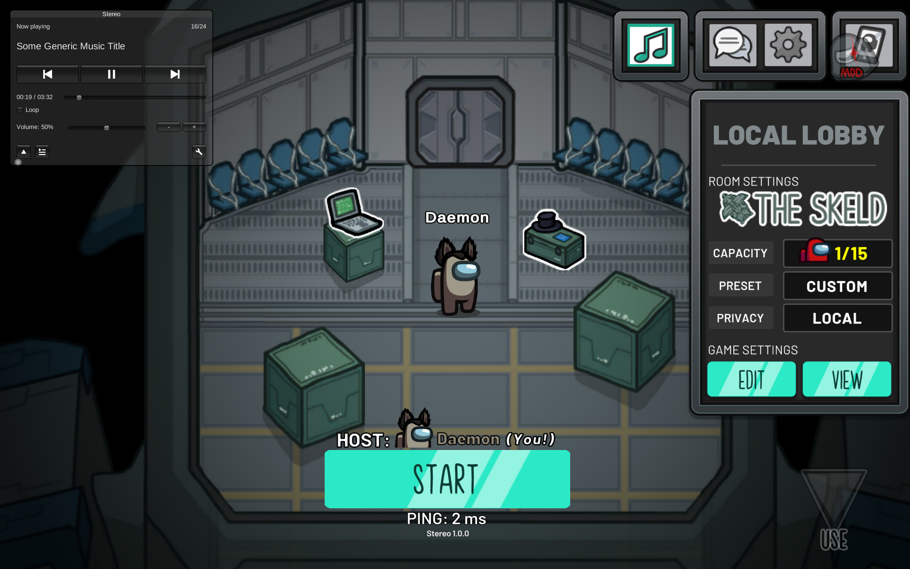

# Note: Stereo works with v2025.11.18(v17.1.0).

# Stereo

Among Us custom lobby music mod.

## Download

1. Navigate to the latest available version of the mod for your version of the game in
[releases](https://github.com/superidol1890/StereoReloaded/releases).
2. Download the specified dependencies, unzipping any zipped files.
3. Download the mod.
4. Put all the downloaded files in your `AmongUs/BepInEx/plugins` folder.

## Usage

1. Start the game with the mod.
2. Place music files (mp3, webm, etc.) in the `AmongUs/Songs` folder.
3. Create a lobby and enjoy :)

> This mod is not affiliated with Among Us or Innersloth LLC, and the content contained therein is not endorsed or
> otherwise sponsored by Innersloth LLC. Portions of the materials contained herein are property of Innersloth LLC. ©
> Innersloth LLC.
